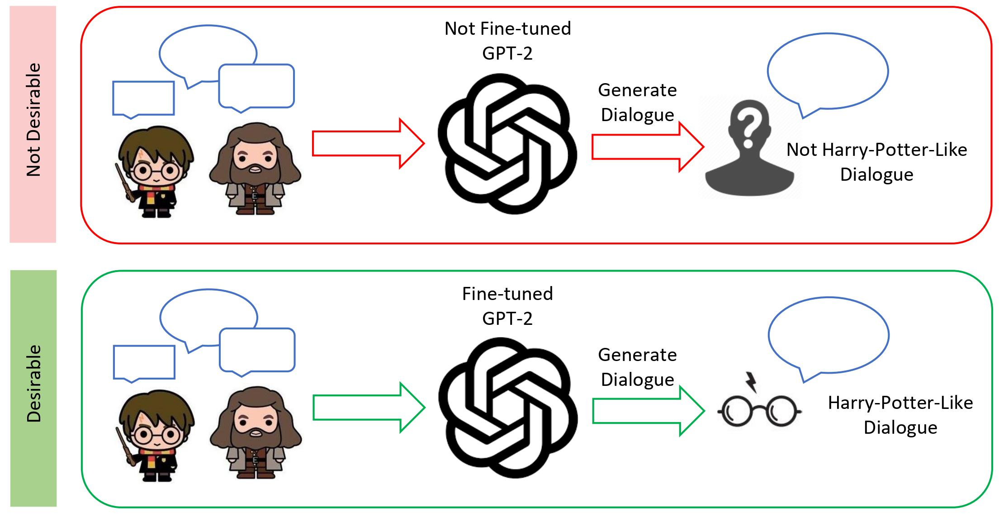
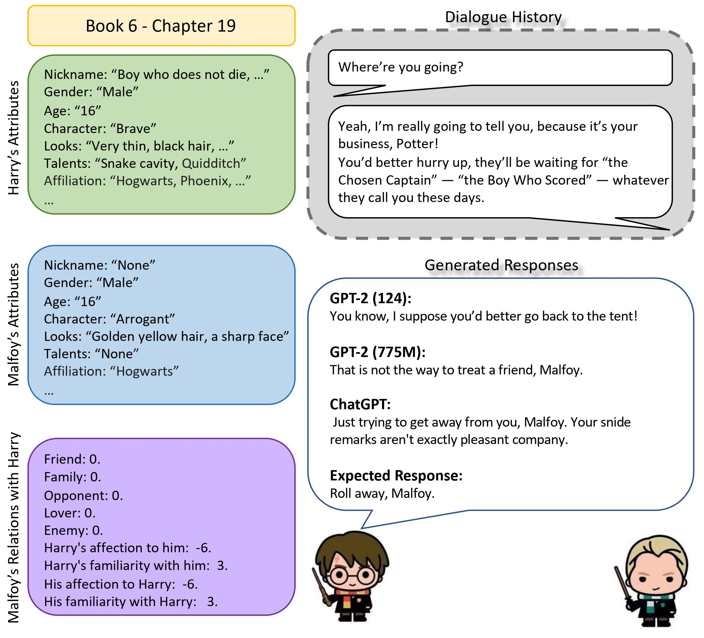

# Exploring Techniques to Generate Dialogues in Hogwarts Legacy Game Using Large Language Models

Kossar Pourahmadi, Atena Saghi <br/>

In this work, we take advantage of language models to generate conversational responses. We fine-tune pre-trained GPT-2 (124M) model on Harry Potter Dialogue dataset to incorporate characters’ attributes, relations, context, and dialogue history, such that we can generate creative and Harry-Potter-like dialogues for Hogwarts Legacy video game. We compare the results of this model with pre-trained GPT-2 (775M) and ChatGPT in terms of fluency, relevance to scene,relevance to attributes, and relevance to relations. Our implementation code is inspired by [gpt-2-simple](https://github.com/minimaxir/gpt-2-simple). You can access our final report [here](report/ECS_289_ACM_SIGPLAN_Conf.pdf)




This repository contains a script written in Tensorflow to fine-tune available pre-trained GPT-2 (124M) on Harry Potter Dialogue dataset. Then you can use the fine-tuned checkpoint to feed samples from test set and generate natural-looking responses.

# Table of Content

1. [Requirements](#Requirements)
2. [Evaluation](#Evaluation)
	1. [Fine-tuning](#ft)
	2. [Generating Responses](#inference)
3. [Results](#results)


## Requirements <a name="Requirements"></a>

* Follow instructions in [gpt-2-simple](https://github.com/minimaxir/gpt-2-simple#install) repository to install this package via [PyPI](https://pypi.org/project/gpt-2-simple/).
* Download Harry Potter Dialogue dataset from [here](https://github.com/nuochenpku/Harry-Potter-Dialogue-Dataset#all_data-download). It includes all json-format files for training/evaluating.


## Evaluation <a name="Evaluation"></a>

It is highly recommended to use GPU to fine-tune the model. Also, please note that the pretrained 124M model is 500 MB. 

### Fine-tuning <a name="ft"></a>

To execute the program, simply run the following command:

```bash
python main.py
```

You can change the hyperparameters in ```main.py```. To change fine-tuning hyperparams, change ```gpt2.finetune()``` in ```main.py```:

```python
gpt2.finetune(sess,
          dataset=file_name,
          model_name='124M',
          steps=1000,
          restore_from='latest',
          run_name='run1',
          checkpoint_dir='checkpoint',
          print_every=10,
          sample_every=200,
          save_every=300
)
```

### Generating Responses <a name="inference"></a>

To change test-time specifications, change ```gpt2.generate()``` in ```main.py```:

```python
gpt2.generate(sess,
          length=50,
          temperature=0.7,
          prefix="YOUR PROMPT",
          nsamples=5,
          batch_size=5
)
```

The fine-tuned checkpoint is also available. You can download the checkpoint from [here](https://drive.google.com/drive/folders/1c_JEb1W9XaUsaBxDvTvQFC40oRW3SP4E?usp=sharing) and put it in ```checkpoint/run1/``` directory. Then to load the checkpoint, use the following code:

```python
import gpt2

sess = gpt2.start_tf_sess()
gpt2.load_gpt2(sess,
            run_name="run1",
            checkpoint_dir="checkpoint"
)

gpt2.generate(sess,
          length=50,
          temperature=0.7,
          prefix="YOUR PROMPT",
          nsamples=5,
          batch_size=5
)
```

## Results <a name="results"></a>

The following table shows the human evaluation results on Harry Potter Dialogue dataset. Relv.Sce, Flu, Relv.Att, and Relv.Re indicate Relevance with the scene, Fluency, Relevance with the character attributes, and Relevance with the character relations, respectively. To obtain these results, we randomly selected 7 samples out of 20 generated samples and requested 15 annotators to rate them in terms of these four criteria. Each criterion is rated on a five-scale, where 1, 3 and 5 represent weak, moderate and perfect performance, respectively.

| Model | Relv.Sce. | Flue. |  Relv.Att. | Relv.Re. |
|--------|-------|------|-------|------|
|Ft. GPT-2 (124M) |2.23 | 4.06 | 2.74 | 2.88|
|Pt. GPT-2 (775M) | 2.82 | 4.31 | 2.71 | 2.66|
|ChatGPT          | 4.43 | 4.63 | 3.88 | 4.20|


The following is a case study:



For the complete list of case studies, you can refer to this [google document](https://docs.google.com/document/d/1nWe-xf7NY-RIbDkbbnYdhSC8n9F0cMzeIz8fDRwGcug/edit?usp=sharing).


